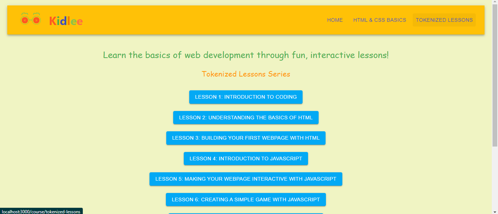
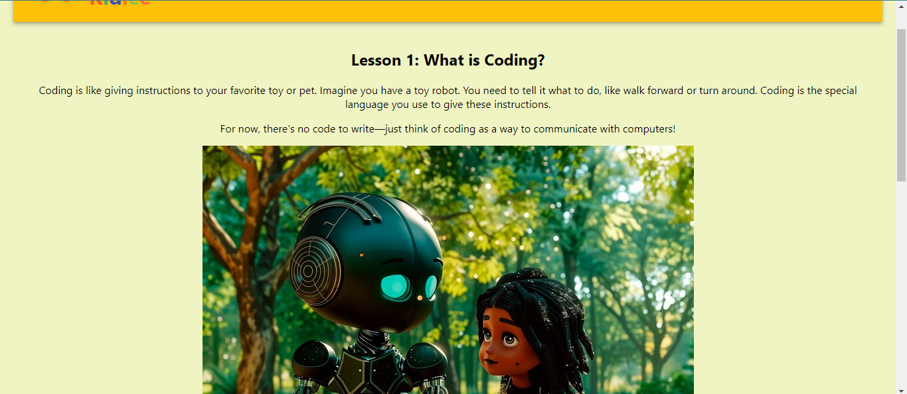
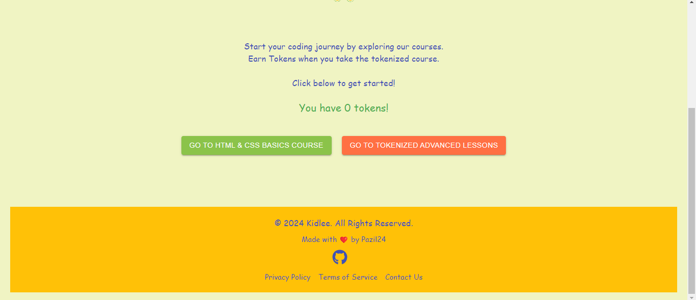

# Kidlee DApp
Kidlee is an educational decentralized application (DApp) designed to make learning coding fun and interactive for kids. It introduces basic coding concepts using HTML, CSS, and JavaScript through engaging lessons and activities. The app also features tokenization to reward kids for completing lessons, making the learning process both educational and rewarding.

## Table of Contents
1. Demo
2. Features
3. Technologies Used
4. Installation
5. Usage
6. Screenshots
7. Contact

## 1. Demo
You can check out a live demo of Kidlee here  [Kidlee Demo](https://youtu.be/N8D9YpwOC9E).

## 2. Features
### Interactive Lessons:
Teaches HTML, CSS, and JavaScript through step-by-step instructions and interactive code editors.
Kids can see real-time previews of their code as they learn.
### Tokenization:
Kids earn tokens as they complete lessons, which can be redeemed for fun rewards within the app.
### Secure Execution:
The app safely runs JavaScript code in a sandboxed environment to prevent security issues.
### User-Friendly Interface:
A colorful, kid-friendly design with an intuitive navigation system.

### Gamification:
The app includes simple games and interactive elements that make learning more engaging.

### Responsive Design:
Works seamlessly on both desktop and mobile devices.
## 3. Technologies Used

### Frontend:
- React.js
- Material-UI
- React Router
- Web3.js

### Blockchain Integration:
- Chainlink Plugin for price feeds
- Web3 for Ethereum integration

### Hosting & Deployment:
[Fleek](app.fleek.xyz)

## 4. Installation
### Prerequisites
1. Node.js and npm installed on your machine.
2. MetaMask or another Ethereum wallet installed in your browser.
3. Clone the Repository
git clone https://github.com/Pazil24/kiddie-dapp.git
4. cd kiddie-dapp
### Install Dependencies
- npm install
### Start the Development Server
- npm start
The app should now be running on http://localhost:3000.

## 5. Usage
#### 1. Navigate through the lessons: Start from the basics and gradually move to more advanced topics. Each lesson includes interactive elements where you can practice what you've learned.

#### 2. Earn Tokens: Complete lessons to earn tokens, which can be redeemed for rewards within the app.

#### 3. Finish the Course: Upon completing all the lessons, redeem your tokens and see your rewards on the home page.

## 6. Screenshots
.png)

## 7. Contact
If you have any questions, feel free to reach out:

- GitHub: Pazil24

- LinkedIn: [Priscilla Azilafu](https://www.linkedin.com/in/priscilla-azilafu)